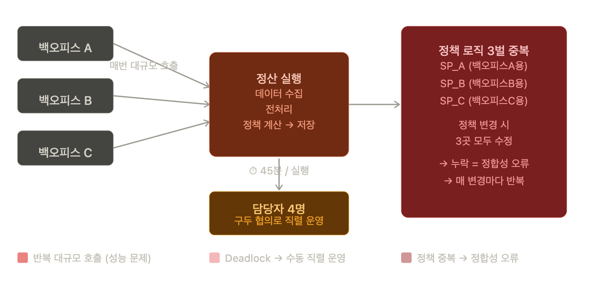
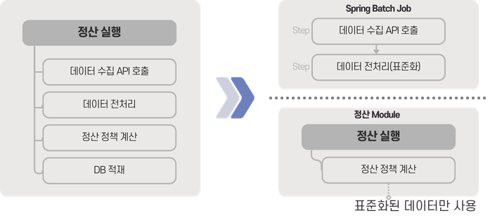
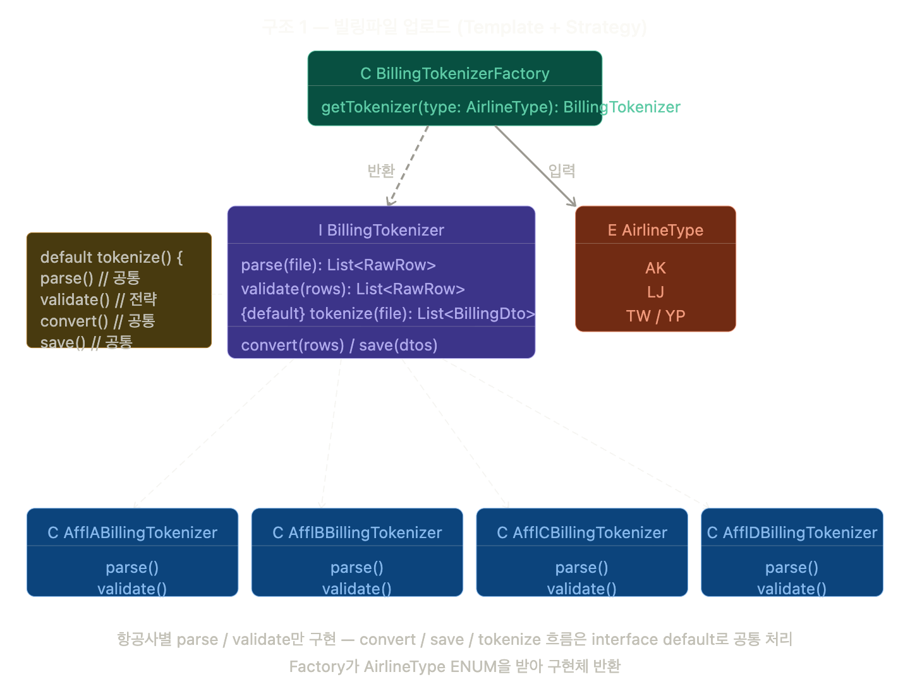
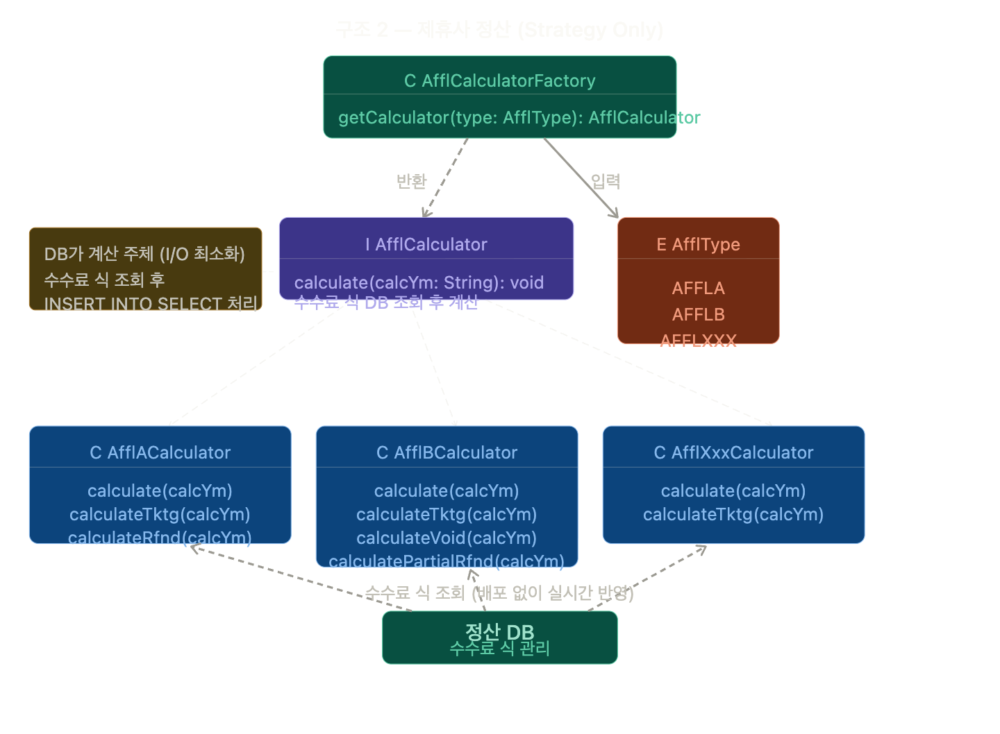

## CLARE 설계 결정기 — 레거시 청산부터 유연한 정책 대응을 위한 아키텍처 설계까지

### 📌 Overview

- **상황:** 항공사·제휴사·PG 정산 정책이 복잡하게 얽힌 레거시 ERP에서 항공 정산 도메인을 MSA로 분리·재구축
- **문제:** 정산 실행마다 대규모 데이터 반복 추출, 백오피스별 파편화된 정책 로직, 잦은 SP 수정과 롤백
- **결정:** 
  - 전처리/정산 실행 계층 분리 
  - 이종 DB 연동 방식 선택
  - Factory + Strategy 패턴 적용
- **성과:** 
  - 정산 처리 시간 45분 → 3분
  - 신규 제휴사 추가 1~2주 → 2일 이내
  - 정책 변경 배포 없이 실시간 반영

> 이상적인 구조보다 실행 가능한 구조를, 단 나중에 갈아끼울 수 있는 여지는 남겨두는 것.

---

### 들어가며
타이드스퀘어에서 2년 5개월간 항공 정산 MSA 시스템 CLARE를 설계하고 운영했다.\
이 글은 기술 선택의 결과가 아니라 왜 그 선택을 했는지, 그리고 이상적인 구조를 포기하고 실행 가능한 구조를 선택한 이유에 대한 기록이다.

---

### 배경 — 왜 분리해야 했나

기존 ERP는 인사, 재무, 항공 정산이 하나의 모놀리식 서비스로 묶여 있었다. 처음에는 각 도메인의 기능과 범위가 복잡하지 않았기 때문에 큰 문제가 아니었다.

문제는 비즈니스가 커지면서 시작됐다. 항공사 정산 외에 제휴사 정산, 투어티켓, 호텔 정산까지 요구사항이 확장됐고, 정산 도메인만의 독립적인 개발과 운영이 필요한 상황이 됐다. 그래서 정산 도메인을 MSA 서비스로 분리하기로 했고, 나는 항공 정산 서비스 CLARE의 설계를 맡았다.

---

### 레거시의 문제점

기존 레거시 시스템의 경우, 크게 세 가지 문제점이 있었다.

#### ① 정산 실행 시마다 대규모 데이터 반복 추출

기존 구조에서 정산은 실행 시점에 3개의 외부 백오피스에서 API와 DB링크로 항공 데이터를 전량 추출하고, DB에 저장한 후 정산 프로세스를 시작했다.

A 제휴사 정산을 돌리면 같은 기간 전체 데이터를 추출하고, B 제휴사 정산을 돌리면 **동일한 데이터를 또 추출**했다.
더불어 재무 데이터 형태에 맞게 피봇된 엔티티 구조에 데이터를 넣기 위해, 기초 데이터(예약/결제/판매가)에 대해 **백오피스 수 × 정산 요소 수만큼 쿼리를 반복**했다. 구조적으로 최적화해도 무조건 시간이 걸리는 방식이었다.

이로 인해 정산 1번에 **평균 45분**이 걸렸고, 동시에 여러 정산을 실행하면 Deadlock이 발생했다. 결국 4명의 정산 담당자가 구두로 협의하며 한 명씩 순서대로 정산 버튼을 눌렀다.

처리 속도가 느린 시스템을 위해, 사람이 직렬로 맞춰주고 있었다.

#### ② 백오피스별 파편화된 정산 로직

3개 백오피스는 각자 다른 DB 스펙과 데이터 구조를 갖고 있었다. 항공료, TAX, 결제금액 같은 금액 항목의 정의조차 백오피스마다 달랐고, 문서화된 것도 없었다.

결과적으로 같은 정산 정책이어도 백오피스별로 로직이 3벌 구현되어 있었다. 정책이 바뀌면 3군데를 모두 찾아 수정해야 했고, 매 변경마다 누락이 발생해 **정합성 오류가 반복**됐다.

#### ③ SP 직접 수정으로 인한 잦은 롤백

제휴사 정산은 정책 변경이 특히 잦았다. 그때마다 SP를 직접 수정하고, 문제가 생기면 롤백하는 사이클이 반복됐다. 변경 이력 관리도 되지 않았다.

---

### 설계 결정

#### 결정 1. 전처리와 정산 실행의 완전 분리

핵심은 **데이터를 가져오는 책임**과 **정산을 실행하는 책임**을 완전히 분리하는 것이었다.

전처리(데이터 수집 + 표준화)는 Spring Batch Job으로 분리해 오프피크 시간대에 주기적으로 실행하고, 정산 실행 시점에는 이미 표준화된 데이터만 사용하도록 구조를 바꿨다.

이렇게 하면 세 가지가 해결된다.

| 문제 | 해결                                                |
|------|---------------------------------------------------|
| 정산 실행마다 백오피스 API 반복 호출 | 1회 수집 후 N개 정산에서 재사용                               |
| 백오피스 구조 변경이 정산 로직으로 전파 | 표준화 책임이 전처리에 응집, 정산은 표준 필드만 바라봄                   |
| Deadlock → 담당자 직렬 운영 | 전처리 단계에서 데이터 수신 및 표준화 완료하여 단일 쿼리로 정산 처리 속도 90% 단축 |

 

#### 결정 2. Kafka + DMS를 쓰지 않기로 했다

이종 DB 통합 문제를 다루면서 사내에 이미 운영 중이던 Kafka + AWS DMS 기반 CDC 파이프라인 활용을 검토했다. 
다른 팀에서 항공 도메인의 이종 DB 데이터를 MySQL로 적재하는 용도로 운영 중이었고, 기술적으로는 가장 이상적인 선택지였다.

하지만 보류했다. 이유는 세 가지였다.

| 검토 대안 | 장점 | 제약                                              | 결과 |
|-----------|------|-------------------------------------------------|------|
| Kafka + DMS CDC | 실시간성, 확장성 | 타 부서 담당 / 우선순위 낮아 일정 지연 위험                      | ❌ |
| 해당 팀 DB에 View 생성 후 활용 | 기존 인프라 재활용 | 정산 관련 테이블 추가 필요 / MSA DB 격리 원칙 위반 / 타 서비스 장애가 정산 장애로 전파 | ❌ |
| **기존 방식 유지 (API/JDBC)** | 협업 범위 내 즉시 구현 가능 | 준실시간 한계                                         | ✅ |

기술적으로 이상적인 구조보다, 조직 제약 안에서 실행 가능하고 장애 전파를 차단할 수 있는 구조를 선택했다.
대신 수집한 데이터를 정산 DB에 표준화해서 적재하는 전처리 레이어를 별도로 두었다.

이 구조에는 현재 제약 해소 외에 다른 의도도 있었다. 
추후 Kafka + DMS CDC 도입이 가능해지면, 전처리 레이어만 교체하면 된다. 
CDC로 표준화된 데이터가 적재되면 전처리 Batch Job을 제거하고, 정산 모듈은 표준화 View에서 데이터를 가져오도록 갈아끼우는 것으로 마이그레이션이 끝난다. 정산 로직 자체는 건드릴 필요가 없다.

전처리와 정산을 분리한 것은 제약 속 차선의 선택이기도 했지만, 기술 부채를 해소할 경로를 열어둔 선택이기도 했다.

 

#### 결정 3. Factory + Strategy 패턴으로 정책 변경 비용 최소화

항공 정산은 LCC/NDC 항공사 추가가 1~2달에 한 번꼴로 잦았고, 제휴사 정산은 프로모션과 수수료 정책 변경이 빈번했다.
잦은 변경에 유연하게 대응하기 위해 두 영역 모두 **Factory + 디자인 패턴 + DB 설정화 구조**를 적용했다.

빌링파일 업로드는 Template + Strategy 패턴으로, 공통 처리 흐름은 interface default 메서드로 고정하고 항공사별 파싱/검증 로직만 구현체로 분리했다.

제휴사 정산은 Strategy 패턴으로 제휴사별 정산 정책을 구현체 단위로 관리하고, 수수료 계산식은 DB에서 조회해 적용한다. 정책이 바뀌면 DB 수정만으로 **실시간 반영**이 가능하다.

그 결과, 레거시에서 신규 제휴사 추가시 1주 이상 걸리던 업무가 CLARE는 테스트 포함 2일 이내로 줄었다.

---

### 설계 밖의 문제들

좋은 구조를 만들었다고 해서 프로젝트가 순탄하지는 않았다. 코드로 해결되지 않는 문제들이 있었다.

**타 개발팀과의 협업**\
백오피스 API 버그 수정 요청이 반복적으로 드롭됐다. 원인은 기술이 아니라 상대 팀의 업무 우선순위였다.\
접근 방식을 바꿔 — 쿼리를 직접 분석하고, 수정 범위와 기대 효과를 한 번에 정리해 전달했다. 이후 요청 처리 속도가 달라졌다.\
협업 병목은 기술이 아니라 상대방의 업무 우선순위 문제였고, 푼 것도 코드가 아니라 요청 방식이었다.

**정산 도메인 용어 표준화**\
전사에 같은 데이터를 부르는 명칭이 제각각이었다. BSP/IATA, DSR/IUR/CSR이 혼용됐고, 같은 명칭인데 계산식이 다른 경우도 있었다. \
관련자들을 직접 찾아다니며 데이터를 대조하고 Confluence에 정리해 공유했다. 그 결과 커뮤니케이션 미스가 줄었고, 신규 합류자의 온보딩 속도도 빨라졌다.

---
### 결과
| 항목 | Before | After |
|------|--------|-------|
| 정산 처리 시간 | 45분 | 3분 (최대 30초) |
| 항공 데이터 전처리 | 정산 실행마다 수행 | 오프피크 배치, 4시간 → 1시간 |
| 정산 동시 실행 | 구두 협의로 직렬 운영 | 병렬 Job 독립 실행 |
| 신규 제휴사 추가 | 1~2주 | 테스트 포함 2일 이내 |
| 정책 변경 방식 | SP 직접 수정 + 배포 | DB 설정 변경으로 실시간 반영 |

---

### 마치며

제약이 많은 프로젝트일수록 이상적인 구조보다 **실행 가능한 구조**를 선택해야 하는 순간이 온다.

중요한 건 차선을 선택하더라도, 나중에 기술 부채를 해소할 수 있는 여지를 구조 안에 남겨두는 것이다.
CLARE에서 전처리 레이어를 분리한 것도 그런 이유였다. 지금 당장 Kafka + DMS를 쓸 수 없더라도, 나중에 갈아끼울 수 있는 구조를 만들어두는 것.

결국 **제약 환경에서의 설계란, 당장의 타협이 나중에 감당할 수 없는 부채로 돌아오지 않도록 '탈출구'를 만들어두는 일**이기 때문이다.