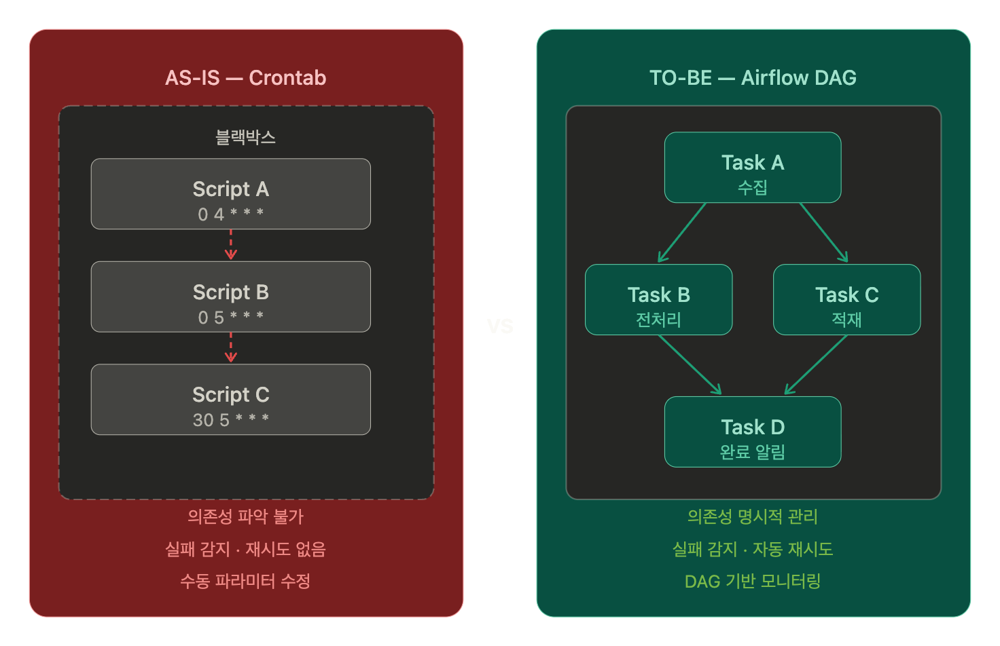

## Crontab에서 Airflow로 — 기술의 한계를 협업으로 돌파하다

### 📌 Overview

+ 상황: 갑작스러운 인력 공백으로 기존 운영 업무와 신규 Spark/Hadoop 구축 프로젝트 병행. 사내 기술 전문가 부재
+ 나의 역할: 데이터 파이프라인 구축 및 배치 스케줄링 환경 개선
+ 핵심 성과 (Result):
  - Crontab 기반 수동 스케줄링 → Apache Airflow 전환
  - 외부 협력을 통한 Hive 적재 안정화 및 시스템 업그레이드 완수

> **Key Insight**\
> 내 지식의 한계를 인정하고, 명확한 상황 공유를 통해 최적의 조력자에게 도움을 이끌어내는 '협업 태도'의 중요성 체득

---

### 배경 — 낯선 생태계와 고립된 상황
갑작스러운 인력 공백은 때로 예상치 못한 성장의 기회가 되기도 한다.

기존 운영 건을 처리하며 동시에 Spark 기반의 대규모 데이터 파이프라인을 구축해야 했던 이 프로젝트가 그랬다.
Hadoop 생태계에 대한 깊은 이해가 부족했던 상태에서 운영 업무와 병행하다 보니, 사소한 호환성 문제조차 트러블슈팅하는 데 한계가 있었다.

당시 환경은 인프라 담당과 애플리케이션 담당 팀이 분리되어 동일한 리소스를 사용하는 복잡한 구조였다.
이러한 상황에서 내부적으로 도움을 줄 수 있는 기술 전문가가 부재했기에 외부로 눈을 돌려야만 했다.

--- 

### Episode 1 — 질문의 기술

Scala에서 Hive로 데이터를 적재하는 과정에서 원인 불명의 에러가 반복됐다.
애플리케이션 단 로그만으로는 인프라 하단의 문제를 파악하기 어려웠다.

고객사에서 Hadoop 버전 업그레이드를 주도하던 PL님께 도움을 요청하기로 했다.
이때 질문의 목적을 '해답 구걸'이 아닌 '문제 범위 축소'에 뒀다.

 **Questioning Skill**
> + AS-IS:\
>   "Hive 적재 중 에러가 발생합니다. 원격으로 한 번 봐주실 수 있을까요?"\
>   -> 문제점: 상대방이 상황 파악부터 시작해야 하므로 업무 리소스가 크게 발생함

> + TO-BE:\
>   "Hive 적재 시 [Error Name]이 발생하여 **[로그 확인 범위]**와 **[시도해 본 3가지 방법]**을 정리했습니다. 
>    인프라 설정상의 이슈인지 확인을 부탁드려도 될까요?"\
>    -> 장점: 상대방이 이미 확인된 내용을 건너뛰고 본질적인 문제에만 집중할 수 있게 함

구조화된 질문 덕분에 담당자분은 야근을 자처하며 내 로컬에 원격 접속해 함께 디버깅해주셨고, Hive 적재 프로세스를 안정화할 수 있었다.

 

### Episode 2 — 신뢰의 활용

기존 배치 작업은 Crontab 기반으로 동작하고 있었다. 
실행은 됐지만 파라미터를 매번 수동으로 수정해야 했고, 작업 간 의존성 파악이나 실패 시 재시도, 모니터링이 불가능한 블랙박스 상태였다.

더 나은 스케줄링 도구를 찾던 중, 이전 프로젝트에서 함께 일했던 타 협력사 담당자분께 조언을 구했다. 
Hadoop 관리팀에서 이미 Airflow로 전체 스케줄링을 운영 중이니, DAG를 작성해 추가하면 된다는 것이었다.

DAG 작성 자체가 기술적으로 복잡한 건 아니었다. 
핵심은 기존 시스템을 얼마나 안정적으로 이관하느냐였는데, 평소 소속에 관계없이 협조적으로 일했던 관계 덕분에 공식 문서 수준을 넘어 실제 운영 환경에 맞는 DAG 구성 템플릿과 의존성 설정 팁까지 전수받을 수 있었다.

덕분에 러닝 커브를 줄이고, 불투명했던 Crontab 배치를 단기간에 가시성 있는 스케줄링 구조로 전환할 수 있었다.

---

### 마치며

이 프로젝트 이후로, 공통 목표 앞에서 소속을 따지는 게 무의미하다는 걸 몸으로 배웠다.
이후 타이드스퀘어에서 팀을 넘나드는 표준화 작업에 먼저 손을 든 것도 그 연장이었다.