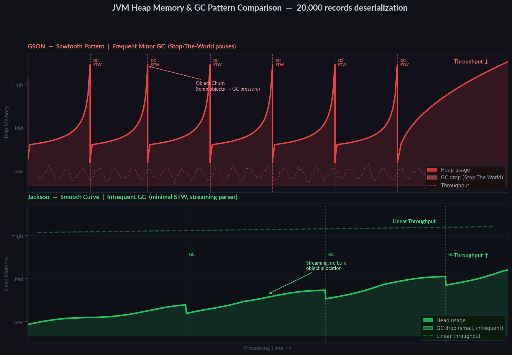
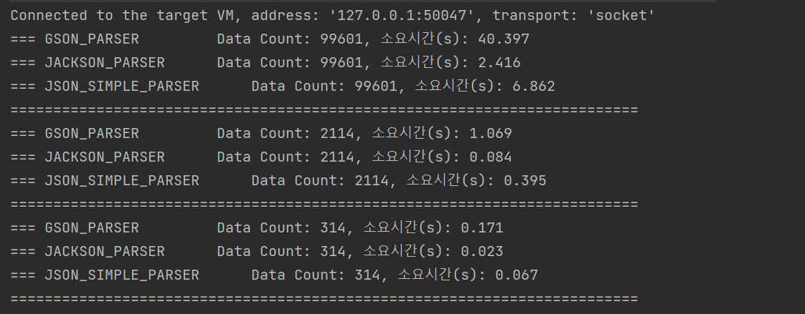

## GSON vs Jackson — 배치 환경에서의 역직렬화 성능 비교와 교체 결정

### 문제 상황

처음 배치를 개발에서 운영으로 배포한 날, 외부 API 연동 배치 작업 중 JSON 역직렬화 단계에서 유독 시간이 오래 소요되는 병목 현상을 포착했다.

-   처리 건수: API 별 5MB 이상
-   병목 구간: JSON → DTO 변환

---

### 원인 분석

기존 프로젝트에서는 API 직렬화/역직렬화 공통 유틸로 GSON을 사용하고 있었으며, 해당 처리 과정에서 성능 병목이 발생했다.
이는 단순한 사용 방식의 문제가 아니라, **라이브러리 간 데이터 처리 구조 차이**에서 비롯된 문제였다.

 

#### 라이브러리별 처리 방식 비교
| 항목         |Jackson|Gson|
|------------|-------|----|
| **파싱 방식**  |스트리밍 기반 (Push/Pull)|리플렉션 기반|
| **캐시 활용**  |내부 캐시 적극 활용|제한적 활용|
| 객체 매핑      |ObjectMapper (강력함)|기본 제공|
| 설계 특징      |재사용 최적화 구조|단순/경량 구조|
| 대용량 처리 |매우 우수|상대적 열세|

 

#### 대용량 데이터 처리 시 GSON의 한계

GSON은 **설정 최소화(Zero-Configuration)** 와 **객체의 불변성**을 중심으로 설계된 라이브러리로, 
개발자가 별도의 설정 없이도 직렬화/역직렬화를 수행할 수 있도록 하는 데 초점을 맞추고 있다.

이를 위해 런타임에 리플렉션을 활용해 클래스 구조를 동적으로 분석하는 방식을 사용하며,
이러한 설계는 사용 편의성과 유연성을 높이는 대신, 다음과 같은 구조적 특성을 가진다.

- 리플렉션 기반 처리 → 반복 수행 시 누적되는 CPU 오버헤드
- 단순한 내부 구조 → 메타데이터 재사용 및 캐싱 최적화에 제한적

즉, GSON은 중간 객체 생성과 리플렉션 기반 처리로 인해 GC가 빈번하게 발생하는 경향이 있으며, 반면 Jackson은 스트리밍 기반 처리로 객체 생성이 상대적으로 적어 안정적인 처리 흐름을 보인다.

_※ 실제 측정값이 아닌, 라이브러리별 처리 특성에 따른 GC/메모리 패턴 차이를 이해하기 위한 개념도입니다._ 

이러한 특성은 일반적인 API 요청 처리에서는 충분히 효율적이지만, 대량 데이터를 반복 처리하는 배치 환경에서는 한계로 작용할 수 있다.

---

### 의사 결정 및 적용

기존 프로젝트의 API 직렬화/역직렬화 공통 유틸은 항공정산 서비스 뿐만 아니라 다른 정산의 영역에서도 사용하고 있었고, 
매 정산주기마다 평균 1.5만 건의 항공정산 데이터와 달리 5천 건이 넘어가지 않아 GSON 라이브러리를 사용하는 데 큰 이상은 없었다.

따라서 공통 모듈 전체를 수정하는 대신, **항공 정산 모듈과 배치 모듈에 한정**하여 Jackson 을 적용하도록 했다. 
의사 결정 과정에서 아래 요소를 고려하였다.

- **리스크 관리**\
    전사 공통 모듈 변경 시 발생할 수 있는 타 서비스의 사이드 이펙트 사전 차단
- **효율적 개선**\
    실제 병목이 발생하는 대량 데이터 처리 작업에 집중하여 최소 비용으로 최대 효과 달성
- **유연한 구조**\
    서비스별 특성(API의 가벼움 vs 대량 데이터 처리)에 맞는 최적의 라이브러리 활용

 

#### 적용 결과

실제 운영 데이터를 기준으로 JSON 파싱 성능을 비교한 결과, 데이터 크기가 커질수록 GSON과 Jackson 간의 성능 격차가 급격히 확대되는 것을 확인했다.

| 데이터 유형 | 데이터 크기 | 건수 | GSON 처리 시간 | Jackson 처리 시간 | 성능 차이 |
|------------|------------|------|----------------|-------------------|-----------|
| 소형 데이터 | 약 1MB     | 314건   | 0.171s         | 0.023s            | 약 7배    |
| **중형 데이터** | 약 5.7MB   | 2,114건 | 1.069s         | 0.084s            | 약 12배   |
| 대형 데이터 | 약 272MB   | 99,601건 | 40.397s        | 2.416s            | 약 16배   |

특히 항공 정산 배치에서 사용하는 월 단위 대용량 데이터(약 270MB) 기준으로는 단일 처리 시간 기준 약 **38초 → 2.4초** 수준으로 단축되었으며, 배치 전체 처리 시간 및 CPU 사용량 감소에 유의미한 개선 효과를 확인할 수 있었다.

---

### 결론

GSON은 설정 없이 간편하게 사용할 수 있도록 설계된 라이브러리로, 일반적인 API 처리나 소규모 데이터 환경에서는 충분히 효율적이다. 
하지만 이러한 설계 철학은 리플렉션 기반 동적 처리라는 구조적 특성으로 이어지며, 대용량 데이터를 반복적으로 처리하는 환경에서는 성능 병목으로 작용할 수 있다.

따라서 모든 영역에 동일한 라이브러리를 일괄 적용하기보다는, **데이터 규모와 처리 방식에 따라 적절한 라이브러리를 선택**하는 것이 중요하다.